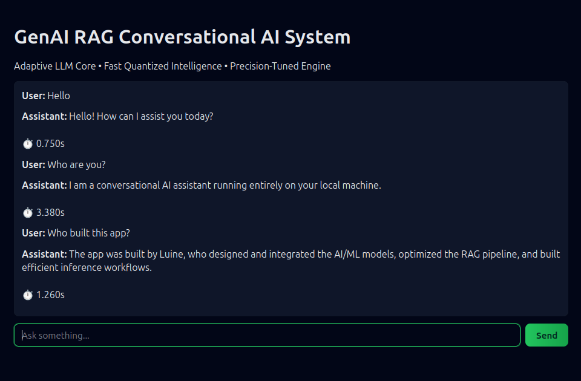

# GenAI RAG Assistant

**GenAI RAG Conversational AI System** 
*Adaptive LLM Core • Fast Quantized Intelligence • Precision-Tuned Engine*

---

## Overview
A lightweight **Retrieval-Augmented Generation (RAG)** system powered by a local LLM. 
Designed for fast, efficient, and fully offline conversational AI with document retrieval.

---

##  Features

###  Core Stack
- **LLM**: Qwen2.5-0.5B (via Ollama) — fast, quantized local inference 
- **Vector Search**: FAISS (CPU) — efficient similarity search 
- **Embeddings**: FastEmbed (ONNX) — ultra-fast encoding 
- **API**: FastAPI — local REST endpoints 
- **Server**: Uvicorn — production-ready ASGI server 

###  Capabilities
- RAG pipeline (embeddings → retrieval → generation)
- Local document search from `/docs`
- Clean frontend served by backend
- Lightweight and fast (CPU-friendly)

---

##  Installation
chmod +x install.sh
./install.sh

---

##  Run the App
source qwen_env/bin/activate
python -m server.app

Open in your browser: 
 http://127.0.0.1:8000

---

##  Preview

---

##  Project Structure
genai_rag/
│
├── install.sh
├── requirements.txt
├── README.md
│
├── server/
│ ├── init.py
│ └── app.py
│
├── client/
│ ├── index.html
│ ├── css/
│ │ └── style.css
│ └── js/
│ └── app.js
│
├── public/
│ └── favicon.ico
│
└── docs/
└── about.txt
